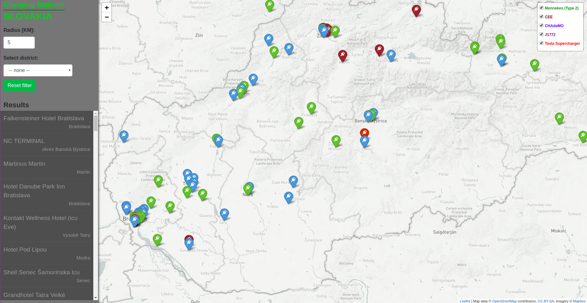
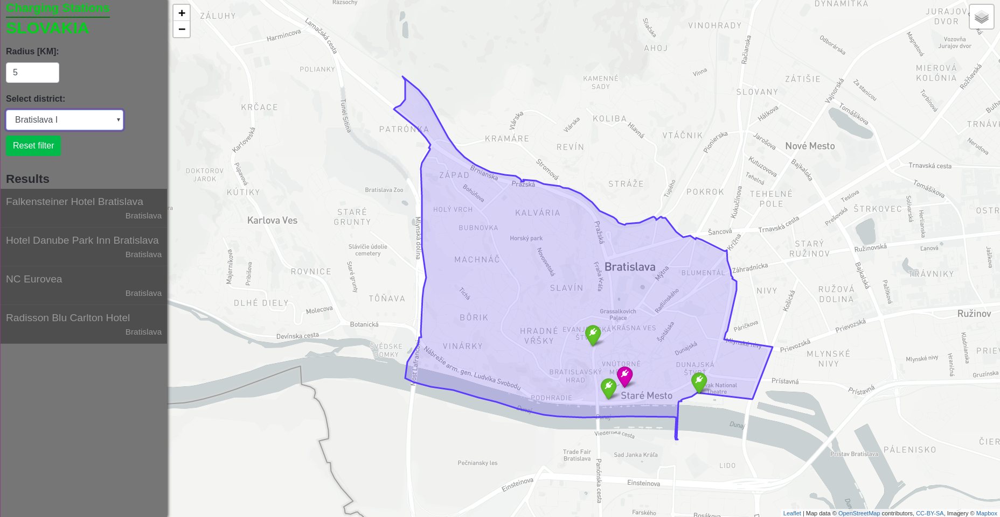
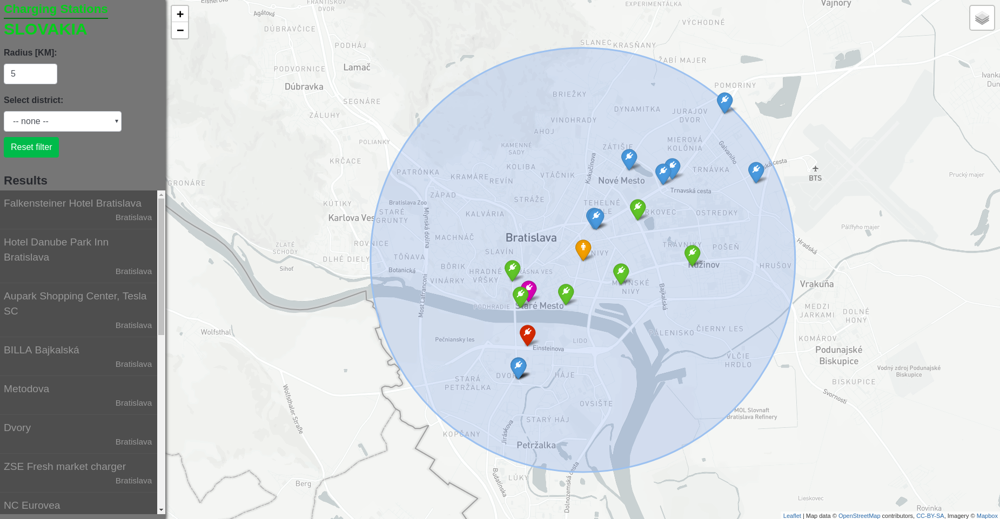
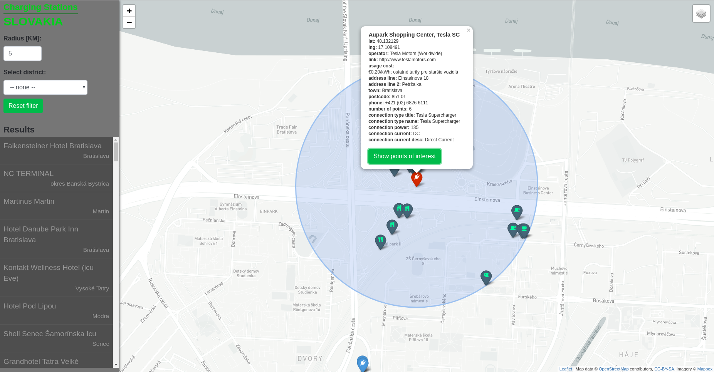

## Úvod

Aplikácia zobrazuje nabájacie stanice pre elektromobily a hybridné automobily v rámci Slovenskej Republiky na mape. Najdôležitejšie funkcie:
- filtrovanie podľa typu nabíjacích staníc (farebne odlíšené a rozdelené do vrstiev)
- zobrazenie staníc podľa okresu
- zobrazenie staníc vo zvolenej vzdialenosti od vybraného bodu na mape
- zobrazenie bodov záujmu v okruhu 500 metrov od zvolenej nabíjacej stanice

## Screenshots

Vzhľad aplikácie


Zobrazenie nabíjacích staníc v okrese Bratislava I


Zobrazenie nabíjacích staníc v okruhu 5 km od zvoleného bodu


Zobrazenie bodov záujmu v okruhu 500 metrov od zvolenej nabíjacej stanice


## Frontend

Frontend aplikácie tvorí statické HTML `static/templates/index.html`. Hlavná logika frontendu je v `static/js/mapbox.js`, ktorý komunikuje s API a stará sa o vykreslenie dát do mapy.

## Backend

Backend aplikácie je vytvorený vo frameworku [Flask](http://flask.pocoo.org/) (python framework). Databázu sme využili PostgreSQL s rozšírením PostGIS. Obsluha API volaní je v súbore `app.py` a o komunikáciu s DB sa stará `models.py`, kde sú jednotlivé queries.

## Dáta

### Open Charge Map
Základné dáta o nabíjacích staniciach pre aplikáciu boli použíte z [Open Charge Map](https://www.openchargemap.org/). Dáta majú dostupné len prostredníctvom API v JSON formáte. Pre uloženie týchto dát sme si vytvorili nasledovnú tabuľku:

```SQL
CREATE TABLE charging_stations (
	id SERIAL PRIMARY KEY,
	operator_title text,
	operator_url text,
	operator_mail text,
	is_pay_at_location boolean,
	is_membership_required boolean,
	usage_cost text,
	address_title text,
	address_line1 text,
	address_line2 text,
	address_town text,
	address_postcode text,
	geom geography,
	contact_phone text,
	number_of_points integer,
	connection_type_title text,
	connection_type_name text,
	connection_amps	integer,
	connection_voltage integer,
	connection_power integer,
	connection_current_type	text,
	connection_current_desc	text
);
```

Dáta sa vkladajú do DB v (`models.py`) v metóde insertDataFromAPI().

### Open Street Maps
Ako ďalší zdroj dát sme použili [Open Street Maps](https://www.openstreetmap.org/). Stiahli sme dáta pre celé Slovensko a importovali do DB pomocou nástroja `osm2pgsql`. Tieto dáta sú použité pre body záujmu.

### Geoportál
Hranice okresov sme stiahli z [Geoportál](https://www.geoportal.sk/). Konkrétne [https://www.geoportal.sk/files/zbgis/na_stiahnutie/shp/ah_shp_0.zip](https://www.geoportal.sk/files/zbgis/na_stiahnutie/shp/ah_shp_0.zip). Dáta sme naimportovali pomocou nástroja `shp2pgsql`.

## API

**Nájde všetky nabíjacie stanice na Slovensku**

`/api/get/all`

**Nájde všetky nabíjacie stanice v okruhu 5 km od bodu [48.233253, 17.248743]**

`/api/get/500/48.233253/17.248743`

**Nájde body záujmu v okruhu 500 m od bodu [48.233253, 17.248743]**

`/api/get/amenity/48.233253/17.248743`

**Nájde všetky okresy na Slovensku**

`/api/get/districts`

**Nájde všetky nbíjacie stanice v okrese Bratislava I**

`/api/get/from/Bratislava I`

**Nájde body tvoriace hranicu okresu Bratislava I**

`/api/get/boundary/Bratislava I`

### Response

Odpoveď na API volanie je pole s obsahom dát vo formáte JSON obsahujúci všetky potrebné informácie. Dáta k jednej nabíjacej stanici vyzerajú nasledovne:

```JSON
[
	{
		"properties":
			{
				"contact_phone": "+42 1259 236100", 
				"address_line1": "Pilarikova Ulica 5", 
				"address_town": "Bratislava", 
				"is_pay_at_location": false, 
				"connection_current_type": "AC (Three-Phase)", 
				"operator_title": "Tesla Motors (Worldwide)", 
				"operator_url": "http://www.teslamotors.com", 
				"operator_mail": null, 
				"address_postcode": "81103", 
				"address_line2": null, 
				"is_membership_required": true, 
				"connection_power": 11, 
				"operator_address": null, 
				"connection_type_name": null, 
				"number_of_points": 2, 
				"usage_cost": null, 
				"connection_type_title": 
				"Mennekes (Type 2, Tethered Connector) ", 
				"address_title": "Falkensteiner Hotel Bratislava", 
				"connection_voltage": 400, "connection_current_desc": 
				"Alternating Current - Three Phase", "connection_amps": 16
			}, 
		"geometry": 
			{
				"coordinates": [17.103715, 48.145909], 
				"type": "Point"
			}, 
		"type": "Feature"
	}
]
```
